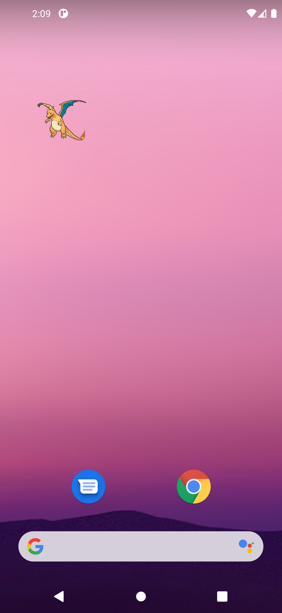

# PokéWidget

Animated Pokémon sprites as Android home-screen widgets. Pick any Pokémon from any
game's sprite set, choose whether it sits on a background, whether tapping plays its cry,
and how large it renders.



---

## How the animation actually works

This is the interesting part, and it is why the app is written in Kotlin rather than
React Native.

A home-screen widget is not a view you own. It is a `RemoteViews` — a serialised view
tree that the **launcher** inflates in **its** process. You cannot run code in it. No
`ObjectAnimator`, no `ValueAnimator`, no custom views, no `ConstraintLayout`. Jetpack
Glance compiles down to `RemoteViews` and inherits every one of those restrictions.

Exactly one animation primitive survives: **`ViewFlipper`**. You hand the launcher a stack
of pre-rendered frames and a flip interval, and it cycles them itself:

```kotlin
views.removeAllViews(R.id.widget_flipper)
for (index in plan.sourceIndices) {
    val child = RemoteViews(packageName, R.layout.widget_frame)
    child.setImageViewBitmap(R.id.widget_frame_image, bitmaps.getValue(index))
    views.addView(R.id.widget_flipper, child)
}
views.setInt(R.id.widget_flipper, "setFlipInterval", plan.frameIntervalMs)
```

That is the whole animation engine. Once the frames are handed over **nothing of ours runs
again** — no alarms, no services, no wakelocks, and `updatePeriodMillis` is `0`. The
launcher even stops the flipping on its own when the widget scrolls off screen.

Two things about this are easy to get wrong, and both cost real debugging here:

- **`setAutoStart(boolean)` is not remotable.** `setFlipInterval(int)` carries a
  `@RemotableViewMethod` annotation; `setAutoStart` does not. Pushing it through
  `RemoteViews` throws `ActionException: ViewFlipper can't use method with RemoteViews`.
  Auto-start has to be declared as `android:autoStart` in the layout XML.
- **The initial layout must not be the flipper layout.** An auto-starting `ViewFlipper`
  with zero children re-posts `showNext()` every `flipInterval` inside the launcher's
  process, burning CPU for a widget that is not showing anything yet. There is a separate
  `widget_initial.xml` placeholder for that reason.

### The memory ceiling

The system rejects any widget update whose total bitmap memory exceeds
`screenWidth * screenHeight * 4 * 1.5` bytes, and it does so by **throwing**, which takes
the launcher down with it. That is **5.3 MB on a 720p phone**.

The sprites blow straight through it. Measured from the pinned source:

| Sprite | Size | Frames | Delays | All frames at 1:1 |
|---|---|---|---|---|
| Showdown Rayquaza | 142×153 | **95** | 30 ms | **7.9 MB** |
| B/W animated Rayquaza | 110×98 | 74 | 60 & 120 ms | 3.0 MB |
| Crystal Bulbasaur | 56×56 | 14 | **10 ms – 990 ms** | 0.2 MB |

`ViewFlipper` also has a *single* interval, so those variable per-frame delays have to be
resampled onto a uniform grid no matter what.

[`FramePlanner`](app/src/main/java/com/pokewidgets/app/sprite/FramePlanner.kt) handles
both problems. It is pure arithmetic on frame metadata — no `Bitmap`, no `Context` — so
the rules that keep the launcher alive are covered by ordinary JVM unit tests:

1. **Resample** the timeline at evenly spaced instants across exactly one loop, so the
   loop closes with no drift.
2. **Collapse identical frames.** Idle loops repeat a lot of artwork; B/W Rayquaza is 74
   frames but only **28 unique**, Crystal Bulbasaur 14 but only **6**.
3. **Fit the budget** by spending whichever resource is cheapest to lose. Above 4× upscale
   it shrinks the sprite — the difference between 8× and 6× pixel art is invisible, the
   difference between 12 fps and 8 fps is not. Below that it defends the size and drops
   frame rate instead.

Two mechanisms make the budget go far:

- **Bitmap dedupe.** `RemoteViews.BitmapCache` keys on object identity, so handing the
  *same* `Bitmap` instance to several frames costs one bitmap. A 990 ms hold that becomes
  a dozen uniform steps is charged once. This is verified against the framework's own
  `estimateMemoryUsage()` in [`WidgetPipelineTest`](app/src/androidTest/java/com/pokewidgets/app/WidgetPipelineTest.kt).
- **Nearest-neighbour integer upscaling.** `Bitmap.createScaledBitmap(..., filter = false)`
  to an exact multiple, with `scaleType="center"` so the `ImageView` never resamples.
  Bilinear filtering is what turns 8-bit art to mush.

The renderer still wraps `updateAppWidget` in a `try/catch` that re-plans against a halved
budget. The planner should never overshoot — but a launcher crash is not a thing to bet
someone's home screen on.

### Static sprites get an idle bob

Every Game Boy Advance set, all of Gen 4, and everything from Gen 6 on exists only as
still PNGs. Emerald's real in-game animation lives inside ROM rips, not in any
distributable mirror. Rather than sit dead on the home screen, those get the gentle
vertical bob the games use in menus — and it is free: the same bitmap goes into every
frame, with only `setViewPadding` differing.

---

## Sprites

Everything is pinned to one commit of [`PokeAPI/sprites`][sprites], so a cached file can
never go stale and jsDelivr can cache it forever. **27 sprite sets, 1,345 Pokémon and
alternate forms.** Three sets are genuinely animated:

| Set | Hardware | Coverage |
|---|---|---|
| **Showdown** | Fan-made, Gen 5 style | 1,283 sprites — every Pokémon through Gen 9 |
| **Black / White** | Nintendo DS | 872 — the original in-game animated battle sprites |
| **Crystal** | Game Boy Color | 250 — the first animated sprites in the series |

The other 24 cover Red/Blue through Scarlet/Violet, box icons, HOME renders and official
artwork, all with the idle bob.

Sprites and cries download on first use and are cached permanently, so a widget keeps
animating with no connection. Only the searchable catalog and ~1,100 box icons (631 KB)
ship in the APK, which keeps it around 10 MB. Cries come from [`PokeAPI/cries`][cries] in
both `legacy` (the harsher Game Boy-era cry) and `latest` flavours.

### Regenerating the catalog

```bash
node tools/build-catalog.mjs          # writes app/src/main/assets/
node tools/build-catalog.mjs --no-cache
```

It walks the sprite tree via the GitHub API (in per-generation chunks — the repo-wide
recursive call truncates at 62k entries), cross-references the PokeAPI CSV dumps for
names, types and generations, and packs the box icons into one blob. Set metadata that a
machine cannot infer — real game names, hardware, ordering — lives in
[`tools/sets.config.mjs`](tools/sets.config.mjs); any set found upstream but missing from
that table is reported and skipped, so new sprite sets are a visible, deliberate addition.

---

## Building

Requires **JDK 17**. `gradle.properties` points `org.gradle.java.home` at a specific
Temurin 17 install — change or delete that line on another machine.

```bash
./gradlew assembleDebug
./gradlew testDebugUnitTest        # frame planner: budget, resampling, trade-offs
./gradlew connectedDebugAndroidTest # end-to-end, needs a device and a connection
```

AGP 8.10.1 · Gradle 8.11.1 · Kotlin 2.1.0 · compileSdk 36 · minSdk 26.

> Android Studio 2022.1 (Electric Eel) cannot open an AGP 8.x project. Build from the
> command line, or update Studio.

### Testing

`FramePlannerTest` runs the planner over every combination of the three measured
worst-case sprites × three screen sizes × four widget sizes × six frame rates and asserts
the budget is never exceeded — 216 plans per run.

`WidgetPipelineTest` runs the real thing on a device: fetch, decode, plan, build the
`RemoteViews`, inflate it, and check the figure the system itself would check. It is what
caught the `setAutoStart` bug.

---

## A note on WorkManager

Widget renders originally ran through WorkManager. Do not put them back.

WorkManager toggles its own broadcast-receiver components with
`PackageManager.setComponentEnabledSetting`. Every toggle fires `ACTION_PACKAGE_CHANGED`
for the package, and `AppWidgetServiceImpl` responds to a package change by
re-broadcasting `APPWIDGET_UPDATE` to every widget that package owns. That update enqueued
more work, which toggled the components again. A single widget on the home screen
re-rendered **once per second, forever**.

A render is a few hundred milliseconds of decode-and-scale with no need to survive reboots
or wait on constraints, so it runs as a plain coroutine started from the receiver's
`goAsync()` window instead.

---

## Legal

Pokémon and all related sprites, cries and names are trademarks of Nintendo, Creatures
Inc. and GAME FREAK inc. This is an unofficial fan project with no affiliation, and it
bundles none of that material — sprites and cries are fetched at runtime from public
community mirrors. Intended for personal use; distributing it through an app store would
invite a takedown.

The pixel typeface is [Press Start 2P](https://fonts.google.com/specimen/Press+Start+2P),
SIL Open Font License (`app/src/main/res/raw/ofl_press_start_2p.txt`).

[sprites]: https://github.com/PokeAPI/sprites
[cries]: https://github.com/PokeAPI/cries
